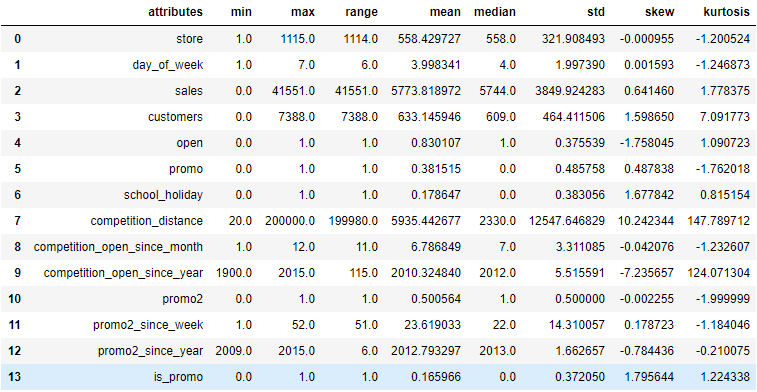
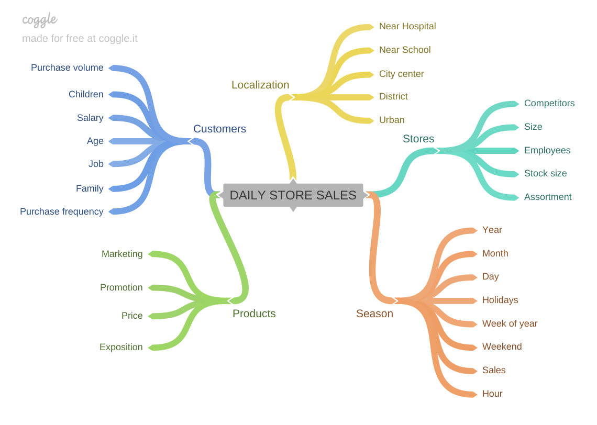
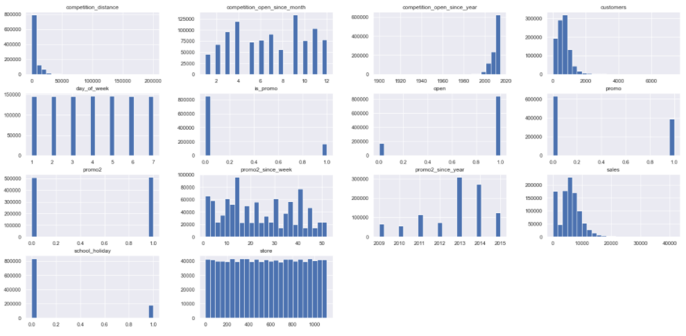
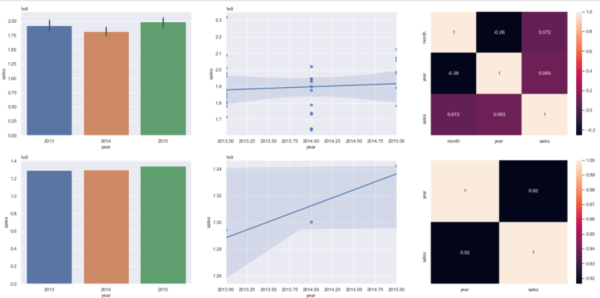
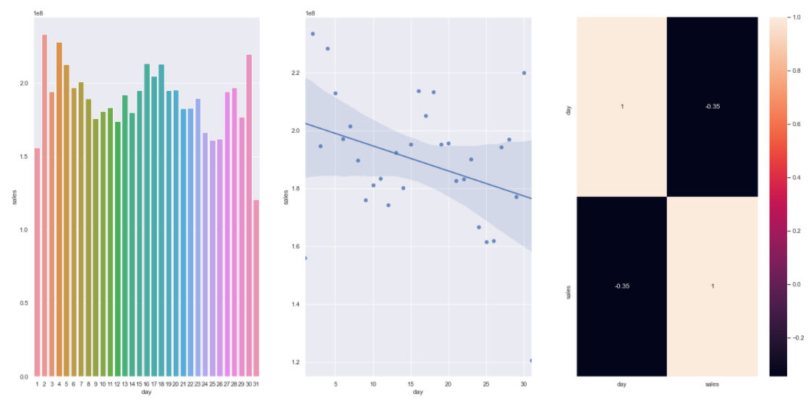
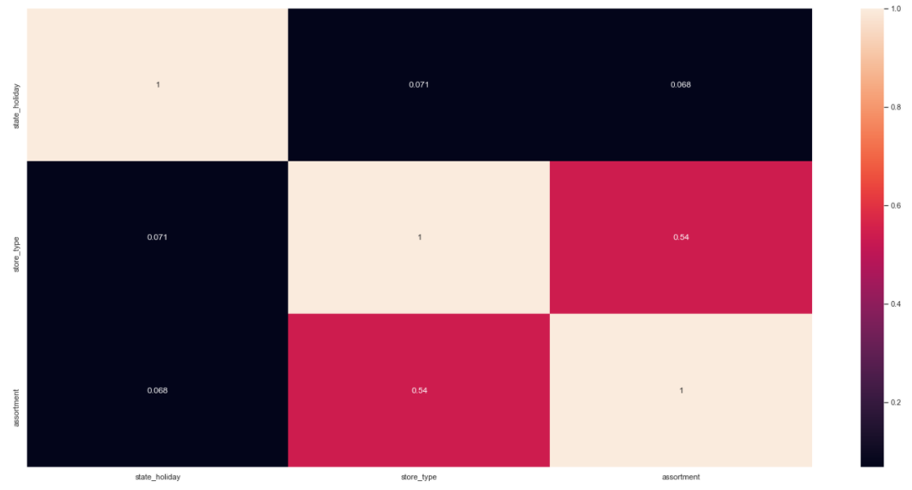
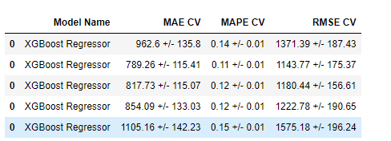

# Rossmann Store Sales 
> First development cycle completed

## 1.0 The Problem

This sales prediction project uses data from Rossmann, a Germany-based drug store chain. The dataset is publicly available from a [Kaggle competition](https://www.kaggle.com/c/rossmann-store-sales/overview/).

Rossmann operates over 3,000 drug stores in 7 European countries. Currently, Rossmann store managers are tasked with predicting their daily sales for up to six weeks in advance. Store sales are influenced by many factors, including promotions, competition, school and state holidays, seasonality, and locality. With thousands of individual managers predicting sales based on their unique circumstances, the accuracy of results can be quite varied. 

## 2.0 The solution

To help the managers and the CFO obtain how much each store could sell, a Telegram bot was made. The user need to send the number store and the bot  would answer the predict total sales by the end of the next six weeks.

How to use:
- Seach for RossmannBotPrediction (Username: @rossmann_pred42_bot) in Telegram
- Enter the store number

## 3.0 Solution Steps

The notebook is structured as:

- 1. Data description
- 2. Feature Engineering
- 3. Variable filtering
- 4. Exploratory data analysis
- 5. Data preparation
- 6. Feature Selection
- 7. Machine Learning Modelling
- 8. Hyperparameter fine tuning
- 9. Translation and interpretation of the error
- 10. Deploy model to production

Below are some points of the project.

### 3.1 Data description

#### Numerical 

Key points:

- There are 1115 stores in the data.
- The mean sales and the median sales are very close.

#### Categorical

Looking at the graph, we can see that the type of store and the assortment have very different medians, which indicates that they can be characteristics that contribute significantly to the model.

### 3.2 Hypothesis Map

This map helped to decide wich one of the variables were necessary to validate the hypothesis.

### 3.3 Response variable

We can observe that the distribution does not follow a normal distribution, indicates that there are outliers and may affect the prediction model.

### 3.4 Numerical variable 

Here we can highlight some points:
- Most competitors are located close to Rossmann
- As time passes the number of competitors is increasing.
- Sales are concentrated on values less than 10,000

### Hypotesis validation - bivariate analysis

#### H2. Stores with more distant competitors should have higher sales.

> *False*. There is a correlation close to zero, but negative, which shows that the more distant the competitors, they sell slightly less.

#### H8.Stores should have higher sales along the years.

> *True*

#### H10.Stores should have higher sales after the 10th day of the month.

> *False*. They sell less.

#### Hypothesis summary

| Hypotesis | Conclusion | Relevance
| ------ | ------ | ------ |
| H1 | True | Medium |
| H2 | False | Low |
| H3 | False | Medium |
| H4 | False | Medium |
| H5 | - | - |
| H6 | False | Medium |
| H7 | False | Medium |
| H8 | True | Low |
| H9 | False | Low |
| H10 | False | Low |
| H11 | True | High |
| H12 | - | - |

### 3.5 Multivariate Analysis

These correlations can be useful for the business team to have a quick view of the relationships of the business variables. Both numerical and categorical multivariate analysis
can be used later in the project.

### 3.6 Machine Learning

The Random Forest had the best result. However, i choice the XGBoost regressor because his model requires less storage capacity.

Using Random Search to find the best parameters to the model, we find the results below.

So, using the parameters of the first line, we arrive at the result below.

After fine tuning:

There was a great improvement.

#### Business Performance

We can observe the results of the predictions with the MAE and MAPE error, in addition to the worst and best forecast scenario. The predictions with the biggest errors are being shown, probably these bad results are derived from outliers.

Some strategies that may solve that problem in the next project iteration:

- Try to use machine learning models that deal better with outliers (hard way)
- Taking a closer look in the data of stores that have outliers in their variables, removing or treating them. (easy way)

Key points:

- in the first graph it is possible to see the pretty close lines, which means that the prediction is pretty close to the real value of sales.
- The error histogram follows a normal distribution.
- The errors of the predictions vary around the zero value and have no tendency. But, there are still some outliers.

## 4 Next Steps

- Validate hypotheses that have not been validated
- Select other features
- Create a new freature
- Use other machine learning models 
- Treat outliers
- Improve the user experience with the telegram bot, adding graphics and other features.
